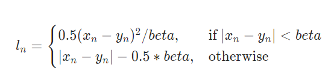

# siam-on-a-quest-in-dnn  
This repository contains all the programs coded and documentations prepared for the **CSE472 (Machine Learning Sessional) Term Project** titled *Siam on a Quest in Deep Neural Network (DNN)*.  

*Siam on a Quest* is a platform game inspired from *[Mario Bros](https://en.wikipedia.org/wiki/Mario_Bros.)*. The objective of this game is to navigate Siam (protagonist) through the map so that it can survive for as long period of time as possible in the game.  

We originally developed this game as our **CSE316 (Microprocessors, Microcontrollers, and Embedded Systems Sessional) Term Project** back in 2019. You will find the project repository [here](https://github.com/MahirSez/CSE-316-Project---Siam-On-a-Quest). Below is a demonstration of the game in Atmega32 microcontroller-powered display with infrared and sonar sensors-based control system.  

A **Deep Reinforcement Learning** agent learns to play the game in this project. We followed this [tutorial](https://pytorch.org/tutorials/intermediate/mario_rl_tutorial.html) as a reference for working on the project. The game was developed using **Pygame** module. The agent and the model was developed using **PyTorch** framework.  

## Problem  
Agent learns to play the game by perceiving the environment. Here, the agent has the following objectives.  
- Avoid horizontal collision with blocks.  
- Avoid falling into gaps between blocks.  

## Algorithm  
**Double DQN** algorithm *[(van Hasselt et al. 2016)](https://ojs.aaai.org/index.php/AAAI/article/view/10295)* is used to train the agent in this project. This algorithm combines the features from **Double Q-learning** *[(van Hasselt 2010)](https://proceedings.neurips.cc/paper/2010/hash/091d584fced301b442654dd8c23b3fc9-Abstract.html)* and **Deep Q Network** *[(Mnih et al. 2015)](https://www.nature.com/articles/nature14236)* algorithms. Double Q-learning reduces action value overestimation by decomposing the max operation in the target into action selection and action evaluation. Deep Q Network (DQN) is a multi-layered neural network for estimating optimal action value function. Important contributions of this DQN algorithm are the usage of a target network and experience replay to train the agent.  

**Adam** is used as model optimization algorithm in this project.  

Also, **Smooth L1 Loss** is used as loss function which combines **L1-loss** and **L2-loss**. It behaves as L1-loss when the absolute value of the argument is high and as L2-loss when the absolute value of the argument is close to zero.  

Smooth L1 Loss combines the advantages of L1-loss (steady gradients for large values of `x`) and L2-loss (less oscillations during updates when `x` is small). The equations are given below. Here, `Xn-Yn` is the difference between true and predicted label and `beta` is a hyperparameter usually equal to `1`.  

## State Engineering  

## Architecture  
The following **CNN** architecture inspired from **LeNet-5** architecture *[(LeCun et al. 1998)](https://ieeexplore.ieee.org/abstract/document/726791)* is used in this project.  

## Performance  
#### First Few Episodes  

#### Around 100th Episode  

#### Around 15000th Episode  

## About Us  
This project was developed by Ajmain Yasar Ahmed Sahil (1605023) and Md. Mahir Shahriyar Sezan (1605024). Also, special thanks to our dearest friend Siam Habib who was kind enough to share with us the story of his amazing quest.  
